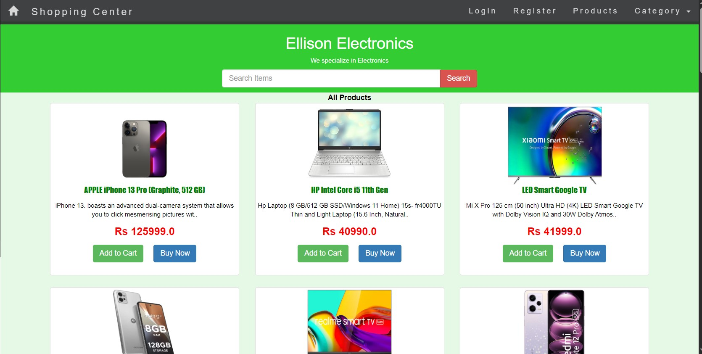
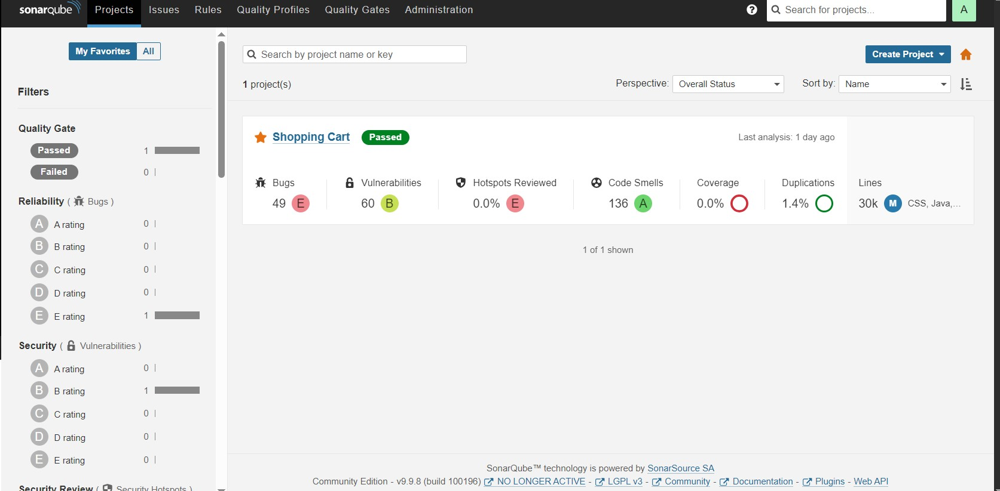
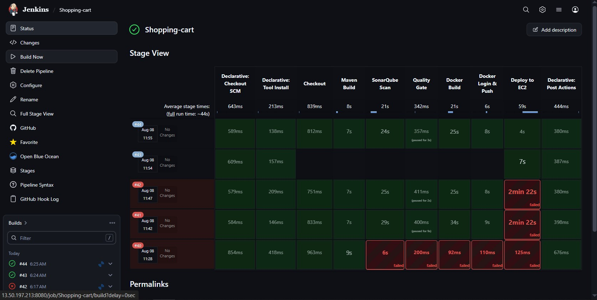

# 🛒 Online Shopping Cart — Java DevOps Project

### About

In this projects a user can visit the websites, registers and login to the website. They can check all the products available for shopping, filter and search item based on different categories, and then add to cart. They can add multiple item to the cart and also plus or minus the quantity in the cart. Once the cart is updated, the user can proceed to checkout and click the credit card payment details to proceed. Once the payment is success the orders will be placed and users will be able to see the orders details in the orders section along with the shipping status of the product.

The admin also plays an important role for this project as the admin is the one responsible for adding any product to the store, updating the items, removing the item from the store as well as managing the inventory. The admin can see all the product orders placed and also can mark them as shipped or delivered based on the conditions.

One of the best functionality that the projects include is mailing the customers, so once a user registers to the website, they will recieve a mail for the successful registration to the website, and along with that whenever a user orders any product or the product got shipped from the store, then the user will also receive the email for its confirmation.
Sometimes, if the user tried to add any item which is out of stock, them they will get an email one the item is available again the stock.

Note: The payment page is created only for demo purpose and its not fully integrated with any payment gateway. So for now any credit card details will be accepted and the demo orders will be placed.

## 🏗️ Architecture

```
                    ┌──────────────────┐
                    │     Developer    │
                    └────────┬─────────┘
                             │
                             ▼
                    ┌──────────────────┐
                    │     GitHub       │
                    │ Source Control   │
                    └────────┬─────────┘
                             │
                             ▼
                    ┌──────────────────┐
                    │     Jenkins      │
                    │    CI/CD Server  │
                    └────────┬─────────┘
                             │
              ┌──────────────┼──────────────┐
              ▼              ▼              ▼
        Maven Build     SonarQube       Unit Tests
              │          Analysis           │
              └──────────────┬──────────────┘
                             ▼
                    ┌──────────────────┐
                    │ Quality Gate     │
                    └────────┬─────────┘
                             │
                             ▼
                    ┌──────────────────┐
                    │  Docker Build    │
                    └────────┬─────────┘
                             │
                             ▼
                    ┌──────────────────┐
                    │ Trivy Security   │
                    │      Scan        │
                    └────────┬─────────┘
                             │
                             ▼
                    ┌──────────────────┐
                    │   Docker Hub     │
                    │ Image Registry   │
                    └────────┬─────────┘
                             │
                             ▼
                    ┌──────────────────┐
                    │    AWS EC2       │
                    │ Docker Compose   │
                    └────────┬─────────┘
                             │
                    ┌────────┴─────────┐
                    ▼                  ▼
             Shopping Cart          MySQL
               Tomcat 9             8.0
```

### ================ Software And Tools Required ================

- : Git [https://www.youtube.com/watch?v=gv7VPQ4LZ7g]
- : Java JDK 8+ [https://www.youtube.com/watch?v=O9PWH9SeTTE]
- : Eclipse EE (Enterprise Edition) [https://www.youtube.com/watch?v=8aDsEV7txXE]
- : Apache Maven [https://www.youtube.com/watch?v=jd2zx3dLjuw]
- : Tomcat v8.0+ [https://youtu.be/mLFPodZO8Iw?t=903]
- : MySQL Server [https://www.youtube.com/watch?v=Ydh5jYA6Frs]
- : MySQL Workbench [https://www.youtube.com/watch?v=t79oCeTXHwg]

## 📂 Project Structure

```
shopping-cart/
│
├── .gitignore
├── Dockerfile
├── Jenkinsfile
├── compose.yml
├── pom.xml
├── LICENSE
├── README.md
│
├── databases/
│   ├── mysql_query.sql
│   └── SHOPPING_CART_ERD.mwb
│
├── src/
│   ├── com/
│   │   └── shashi/
│   │       ├── beans/
│   │       ├── constants/
│   │       ├── service/
│   │       ├── srv/
│   │       └── utility/
│   │
│   └── test/
│       └── java/
│
├── WebContent/
│   ├── index.jsp
│   ├── login.jsp
│   ├── register.jsp
│   ├── userHome.jsp
│   ├── userProfile.jsp
│   ├── cartDetails.jsp
│   ├── payment.jsp
│   ├── orderDetails.jsp
│   ├── adminHome.jsp
│   ├── adminStock.jsp
│   ├── addProduct.jsp
│   ├── updateProduct.jsp
│   ├── removeProduct.jsp
│   └── WEB-INF/
│       └── web.xml
│
└── Kubernetes manifests/
    ├── namespace.yml
    ├── configmap.yml
    ├── secret.yml
    ├── deployment.yml
    ├── service.yml
    ├── ingress.yml
    ├── mysql-deployment.yml
    └── mysql-service.yml
```

### =========================== CREDENTIALS ======================

Step 1: Default Username And Password For Admin Is "admin@gmail.com" And "admin"

Step 2: The default Username And Password For User Is "guest@gmail.com" And "guest"

## FAQ

#### Some Screenshots for the project:

- Home Page
  
- Login Page
  
- Stock Items
  
- SonarQube Dashboard
  
- CI/CD Pipeline
  
- Class Diagram
  

#### "Suggestions and project improvement ideas are welcomed!"

<bold>Thanks a lot,</bold><br/>
Project Leader<br/>
<b>Ratnesh Vansh Saxena</b>
